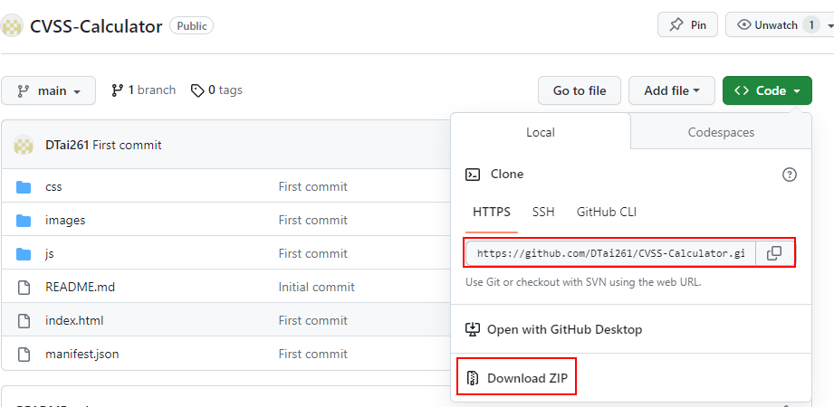
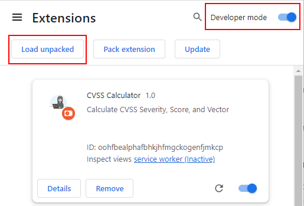
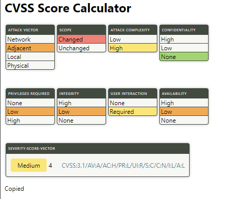
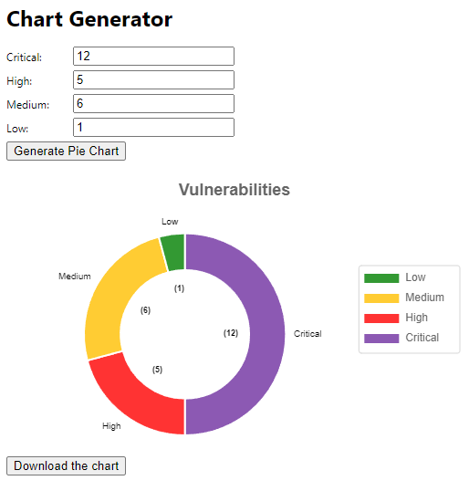
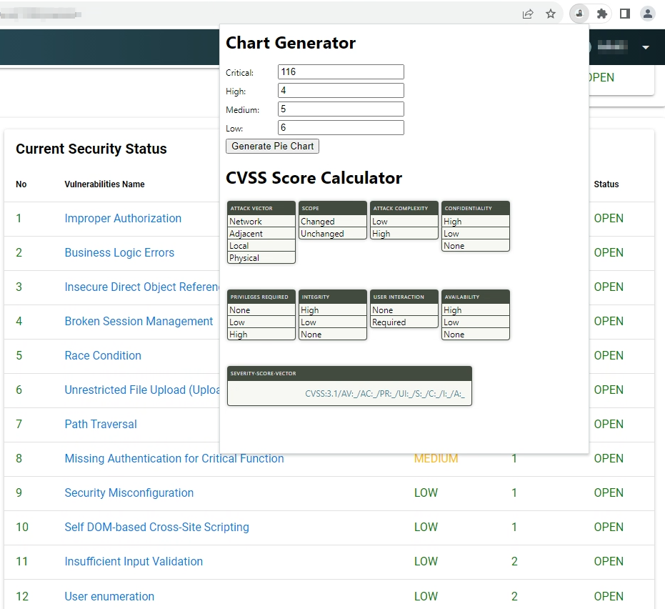

# CVSS-Calculator
## How to install
To load an unpacked extension in developer mode:

1. Git clone or download ZIP file of this extension 

2. Go to the Extensions page by entering [chrome://extensions](chrome://extensions) in a new tab. (By design chrome:// URLs are not linkable.)
- Alternatively, click on the Extensions menu puzzle button and select **Manage Extensions** at the bottom of the menu.
- Or, click the Chrome menu, hover over **More Tools**, then select **Extensions**.

3. Enable Developer Mode by clicking the toggle switch next to **Developer mode**.

4. Click the **Load unpacked** button and select the extension directory. 

5. By default, when you load your extension locally, it will appear in the extensions menu Puzzle. Pin your extension to the toolbar to quickly access your extension during development.

## Features
- CVSS Score Calculator, you can copy the score by click on it

- Generate doughnut chart like in the report

- Auto fill the form when access the log bug tool.
